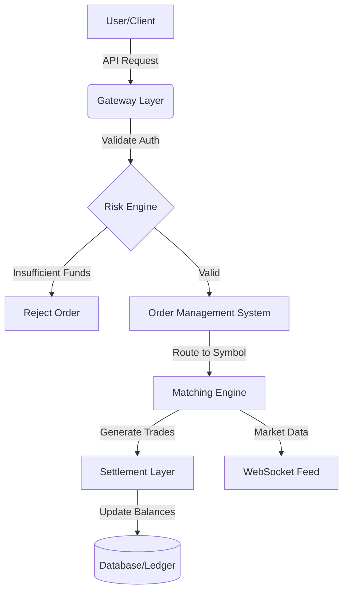
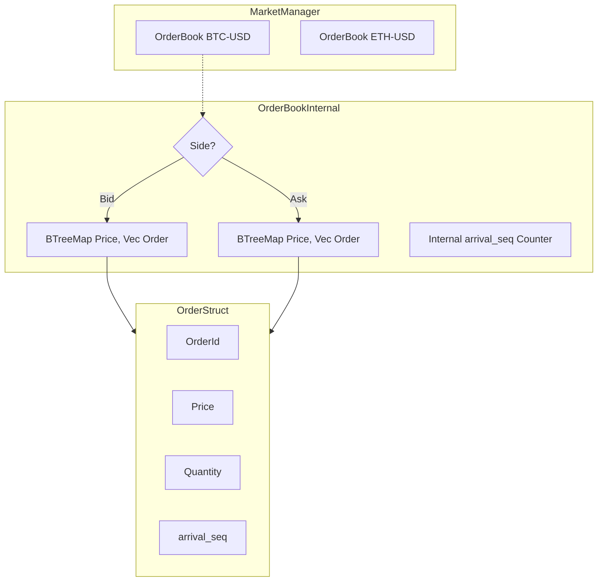

# ferrum-match

## High-Over View (system architecture)

```mermaid
graph TD
    A[User/Client] -->|API Request| B(Gateway Layer)
    B -->|Validate Auth| C{Risk Engine}
    C -->|Insufficient Funds| D[Reject Order]
    C -->|Valid| E[Order Management System]
    E -->|Route to Symbol| F[Matching Engine]
    F -->|Generate Trades| G[Settlement Layer]
    G -->|Update Balances| H[(Database/Ledger)]
    F -->|Market Data| I[WebSocket Feed]
```

## Detailed engine structure

```mermaid
graph TD
    subgraph MarketManager
        OB1[OrderBook BTC-USD]
        OB2[OrderBook ETH-USD]
    end

    subgraph OrderBookInternal
        Direction{Side?}
        Direction -->|Bid| Bids[BTreeMap Price, Vec Order]
        Direction -->|Ask| Asks[BTreeMap Price, Vec Order]
        Seq[Internal arrival_seq Counter]
    end

    subgraph OrderStruct
        ID[OrderId]
        P[Price]
        Q[Quantity]
        S[arrival_seq]
    end

    OB1 -.-> Direction
    Bids --> OrderStruct
    Asks --> OrderStruct
```

## Matching mechanism

```mermaid
flowchart TD
    Start([Incoming OrderRequest]) --> Seq[Assign arrival_seq and create Order]
    Seq --> Loop{Quantity > 0?}
    
    Loop -- Yes --> BestPrice[Fetch Best Opposite Price from BTreeMap]
    BestPrice --> MatchCheck{Price Match?}
    
    MatchCheck -- Yes --> GetLevel[Fetch Price Level Vector]
    GetLevel --> GetMaker[Select first order - Time Priority]
    
    GetMaker --> Calc[Calculate qty_traded: min of Taker/Maker]
    Calc --> CreateTrade[Create Trade object with maker_arrival_seq]
    
    CreateTrade --> Update[Update quantities and Remove empty orders]
    Update --> Loop
    
    MatchCheck -- No --> AddToBook[Add remainder to BTreeMap]
    BestPrice -- No Opposite Orders --> AddToBook
    
    Loop -- No --> Finish([Return Trades Vector])
    AddToBook --> Finish
```
