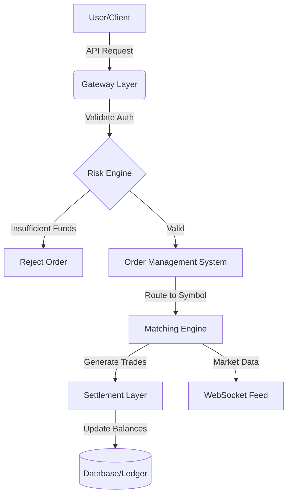
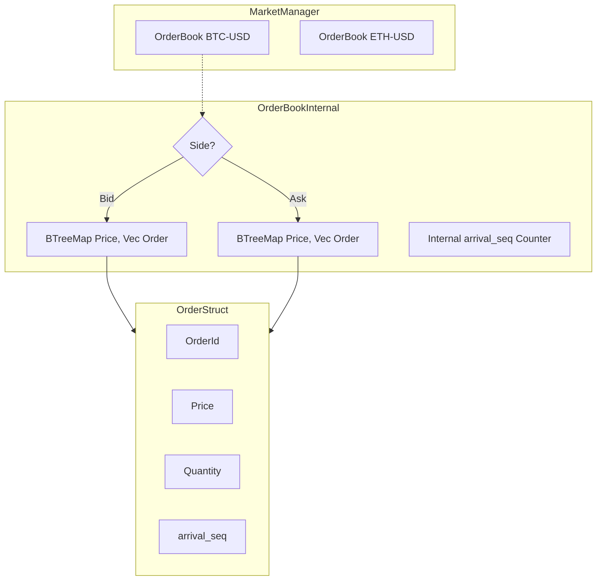
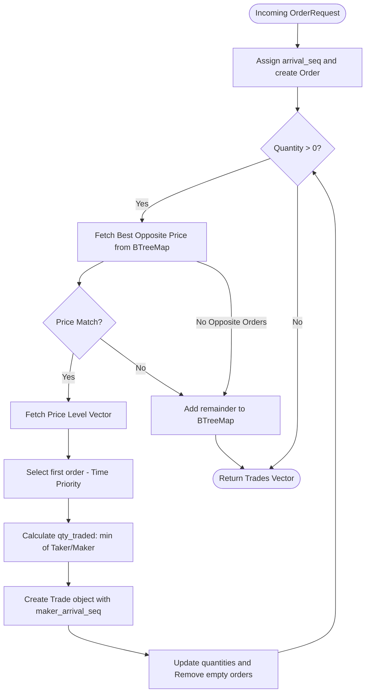

# ferrum-match

A small matching engine for a crypto exchange. You place buy and sell orders; when prices cross, they trade. Anything left over stays on the order book.

## Stack

- **Language:** Rust (2021 edition)
- **CLI:** [clap](https://crates.io/crates/clap) for commands, [rustyline](https://crates.io/crates/rustyline) for the interactive prompt
- **Logging:** [tracing](https://crates.io/crates/tracing)
- **Tests:** `cargo test`, plus [proptest](https://crates.io/crates/proptest) for property-based tests
- **CI:** GitHub Actions

## How to use

Install [Rust](https://rustup.rs/), then from this repo:

```bash
cargo run -- --help
```

### Interactive mode

Best way to try it. One order book stays in memory while you type commands:

```bash
cargo run -- interactive
```

| Command | What it does |
| --- | --- |
| `buy 100 5` | Buy 5 at price 100 |
| `sell 100 3` | Sell 3 at price 100 |
| `print` | Show the book |
| `delete 1` | Cancel order id 1 |
| `exit` | Quit |

Price and quantity are whole numbers. If a buy and a sell overlap, they match. Leftover size stays on the book.

### One-shot commands

Each of these starts with an empty book:

```bash
cargo run -- add --side buy --price 100 --quantity 5
cargo run -- view-book
cargo run -- cancel --id 1
```

`run` (headless server) is not implemented yet.

### Tests

```bash
cargo test
```

## High-Over View (system architecture)


## Detailed engine structure


## Matching mechanism

